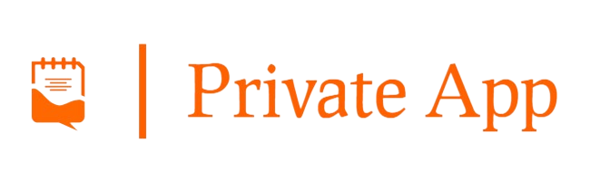

<p id="top" align="center">
  <a href="" target="_blank">
    
  </a>
</p>

<h1 align="center" class="dotted">
    <a href="" target="_blank">Private App</a>
</h1>

<br>

<p align="center">
  


<a href="https://github.com/PrathmeshSoni">

</a> 

</p>

Leveraging the Google Drive API, this dynamic web application revolutionizes photo and video management through chronological date-based notes.


# Live Demo 👇:

<a href="" target="_blank">private-app.sachinandan.versel</a>

<br>

## Table Of Contents :

* [About the Project](#About-The-Project)
* [Technologies Used](#technologies-used)
* [Features](#Features)
* [Getting Started](#Getting-Started)
  * [Prerequisites](#Prerequisites)
  * [Installation](#installation)
* [Credentials](#Default-Credentials)
* [Screenshots](#Screenshots)
* [Connect Me](#Connect-with-me-at)

## About The Project


Welcome to the Private App repository! This dynamic web application revolutionizes photo and video management through chronological date-based notes. Crafted with precision using Django, it offers a seamless and delightful user experience.


## Technologies Used

- Backend: Powered by Python and Django for robust functionality.
- Media Management: Leveraging Google's API (Google-API-Python-Client & Google-Cloud) for seamless media handling.
- Frontend: HTML, CSS, and Bootstrap create an intuitive and visually appealing user interface.
- Interactivity: JavaScript, jQuery, and AJAX add interactivity for an enhanced user experience.
- Database: MySQL ensures reliability and scalability.


## Features

- User Authentication: Secure login and registration for a personalized shopping experience.
- Chronological Brilliance: Efficiently manage photos and videos, neatly organized by date and time.
- Google Drive Integration: Seamlessly upload and download media using Google Drive API for enhanced accessibility.


## Getting Started

This is an example of how you may give instructions on setting up your project locally.
To get a local copy up and running follow these simple example steps.

### Prerequisites

Install Python 3.7 or above

* <a href="https://python.org/downloads/" target="_blank">Python</a>

### Installation

> 👉 **Step 1** - Download the code from the GH repository (using `GIT`):
```bash
git clone https://github.com/sachinandan-05/Private-App.git && cd Private-App
```

<br />

> 👉 **Step 2** - Create virtual environment:
```
python -m venv .venv
```

<br />

> 👉 **Step 3** - Activating the environment:

on Windows:
```bash
.venv\Scripts\activate.bat
```
on Mac OS / Linux:
```bash
source .venv\Scripts\activate
```

<br />

> 👉 **Step 4** - Installing dependencies:

```bash
pip install -r requirements.txt
```


<br />

> 👉 **Step 5** - You can now run the development server:

```bash
python manage.py runserver
```

Visit [`http://127.0.0.1:8000`](http://localhost:8000) in your browser. The app should be up & running.


<br />

> 👉 **Step 6** - Go `config.py` Not Necessary:


Go to the `config.py` file on the Private-App folder (`/private_info/config.py`) setting all requirements after "=". 

```
# For sending email to users during registration or password recovery
email = ""
password = ""

# Set the Google Drive folder ID where uploaded photos will be stored
google_drive_folder_id = ""
```

<br>

> 👉 **Step 7** - Configure Google Drive API credentials.

Create a new project on Google Cloud Console and enable Google Drive API. Create a new OAuth 2.0 client ID and download the credentials file. Rename the file to `client_secret.json` and place it in the 
`/Private/token_file` folder.

Documentation: <a href="https://developers.google.com/drive/api/v3/quickstart/python" target="_blank">Google Drive API</a>

now you can run the Google.py file to get the token file.
```bash
cd Private && python Google.py
```

now rerun the server and you are good to go.
```bash
cd .. && python manage.py runserver
```


<br />

## Default Credentials

- **User Credentials:**
  - Username: admin
  - Password: admin@123


The repository is a starting point for most of my professional projects; for this, I'm using it as a part of my portfolio, feel free to use it wherever you want. I'll be happy if you provide any feedback code improvements or suggestions.


## Connect with me at

<p align='center'>
  <a href="https://www.linkedin.com/in/sachinandan-yadav-660115243/" target="_blank">
    
  </a>
</p>

<p align='center'>
  📫 How to reach me: <a href='mailto:sachinandan.priv05@gmail.com'>sachinandan.priv05@gmail.com</a>
</p>


## All Set :)

<p style="float:left;" align="left">
  <a href="#top">Back To Top</a>
</p>

<p style="text-align:right;" align="right">
  <a href="https://github.com/PrathmeshSoni/Private-App" target="_blank">Back To Repository</a>
</p>


